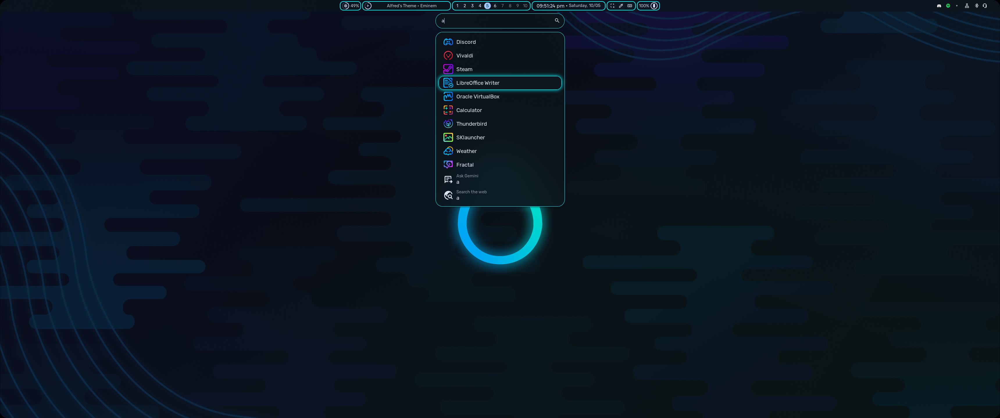
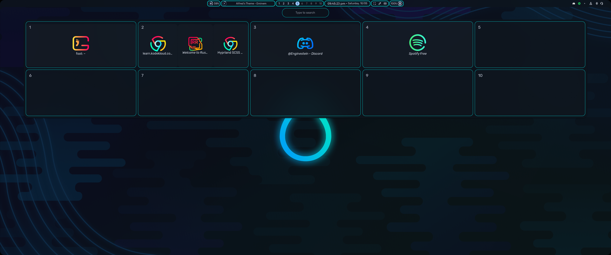

# ✨ Hyprland SCSS Tweaks

A personal collection of SCSS modifications built on top of [end-4's Hyprland dotfiles](https://github.com/end-4/dots-hyprland), aiming to bring a fresh, aesthetic, and dynamic touch to the Hyprland experience.

## 🎯 Overview

This repo contains custom SCSS tweaks that modify various UI components like:
- **Bars (AGS)**
- **App Launchers**
- **Popups & Widgets**
- **Colors, Borders & Animations**

All styles are optimized for a minimal, clean, and modern Wayland environment while staying faithful to end-4's original layout philosophy.

---

## 🌈 Features

- ✳️ Clean and modular SCSS structure
- 🎨 Themeable variables for easy customization
- 🌀 Smooth hover animations and transitions
- 📐 Pixel-perfect padding, borders, and spacing
- 🧩 AGS component-specific enhancements (e.g. volume sliders, search bar, media controls)

---

## 📸 Preview
**Apps**

**Overview**

**Sidebars**


## 🛠️ Installation

Copy the code snippets into the matching files, and use the border-editing script to change colours.

---

## 🔧 Border Editing Script

A utility script is included: `edit-borders.sh`

It allows you to update the colors of all border/glow styles across AGS, Hyprland, and Hyprtrails with one command.

### Usage

```bash
./edit-borders.sh -hex "#ff00ff"
```

You can also update only specific parts:

```bash
./edit-borders.sh -hex "#0aa4e5" -part bar -part notifications
```

### Supported parts:
```
bar
notifications
overview
sidebars
cheatsheet
```

### What it updates:
- SCSS borders in `~/.config/ags/scss/`
- Hyprland plugin borders in `rules.conf`
- (Hyprtrails color in `env.conf` (in correct `rgba(hexcodeff)` format) ) this part does not work yet

AGS is automatically restarted so changes apply immediately.
