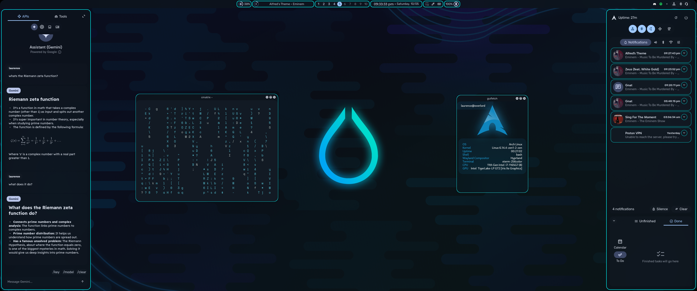

# ✨ Hyprland SCSS Tweaks

A personal collection of SCSS modifications built on top of [end-4's Hyprland dotfiles](https://github.com/end-4/dots-hyprland), aiming to bring a fresh, aesthetic, and dynamic touch to the Hyprland experience.

## 🎯 Overview

This repo contains custom SCSS tweaks that modify various UI components like:
- **Bars (AGS)**
- **App Launchers**
- **Popups & Widgets**
- **Colors, Borders & Animations**

All styles are optimized for a minimal, clean, and modern Wayland environment while staying faithful to end-4's original layout philosophy.

---

## 🌈 Features

- ✳️ Clean and modular SCSS structure
- 🎨 Themeable variables for easy customization
- 🌀 Smooth hover animations and transitions
- 📐 Pixel-perfect padding, borders, and spacing
- 🧩 AGS component-specific enhancements (e.g. volume sliders, search bar, media controls)

---

## 📸 Preview
**Apps**

**Overview**

**Sidebars**


## 🛠️ Installation

1. Clone this repo:
   ```bash
   git clone https://github.com/yourusername/hyprland-scss-mods ~/.config/ags/scss
